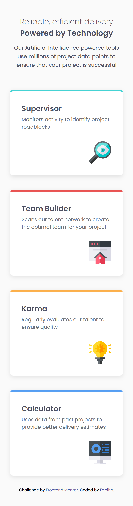

# Frontend Mentor - Four Card Feature Section

This is a solution to the [Four card feature section challenge](https://www.frontendmentor.io/challenges/four-card-feature-section-weK1eFYK) on Frontend Mentor.

### 🔗 Live Site

[View live](https://fabiha517.github.io/four-card-feature-section-master/)

### Solution URL

[View solution](https://github.com/Fabiha517/four-card-feature-section-master)

### 📸 Screenshots

#### ✅ Desktop View

#### 📱 Mobile View

---

## 💡 Built With

- Semantic HTML5
- Modern CSS (Grid, Flexbox, Media Queries)
- `clamp()` for fluid typography and responsive card sizing
- Mobile-first workflow
- No JavaScript!

---

## ⚙️ Features

- Fully responsive layout from mobile to large desktops
- Custom grid layout with overlapping rows and columns
- Smooth hover animation on cards
- Adaptive padding for taller screens (iPhones included)

---

## 📚 What I Learned

- How to use CSS Grid to place elements across custom rows and columns
- How to combine `clamp()` and `min-height` for flexible card sizing
- How to handle vertical cut-off issues on tall or zoomed-in screens
- How to use `@media (min-height: …)` to adapt for ultra-tall devices

---

## 🚧 Challenges Faced

- Content getting cut off on iPhones and zoomed-in screens — fixed using `min-height` and `padding-bottom` with media queries
- Making cards align across specific grid rows/columns without interfering with responsiveness
- Ensuring clean layout even on large resolutions like 2560px+

---

## ✨ Author

- GitHub: [Fabiha517](https://github.com/Fabiha517)

---
